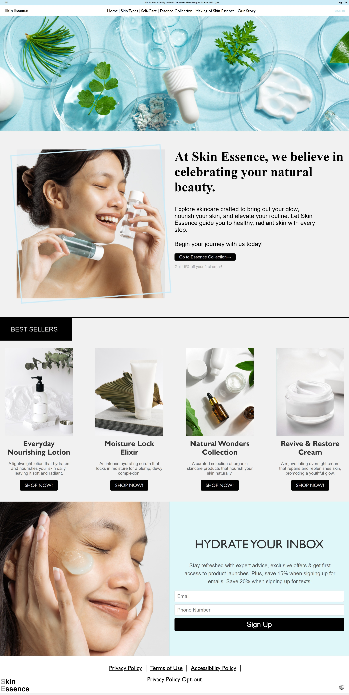

# SkinEssence


**SkinEssence** is a responsive web application that simplifies skincare education by providing personalized routines, ingredient knowledge, and natural remedy guidance. Built to make professional skincare advice accessible to everyone.

<div align="center" style="margin: 40px 0;">

  

</div>

[SkinEsssence](https://skin-essence.onrender.com/)

##  Why SkinEssence?
Transforms overwhelming skincare information into clear, personalized guidance based on individual skin types and concerns.


##  Demo

 Visit the [live demo](https://skin-essence.onrender.com/) to see SkinEssence in action


##  Key Features

- **Skin Type Assessment** - Interactive guide for oily, dry, combination, and sensitive skin
- **Ingredient Database** - Learn about skincare ingredients and their benefits
- **Natural Solutions** - Safe DIY treatments and natural remedy suggestions
- **Responsive Design** - Optimized for all devices with mobile-first approach

##  Technical Stack

```
Frontend: HTML5, CSS3, JavaScript (ES6+)
Design: Responsive layouts with CSS Grid & Flexbox
Performance: Image optimization, lazy loading, clean code architecture
```


##  Skills Demonstrated

- **Frontend Development** - Modern HTML5, CSS3, and JavaScript implementation
- **User Experience** - Clean interface design with intuitive navigation
- **Performance Optimization** - Fast loading with optimized assets
- **Code Quality** - Maintainable, well-structured codebase


##  Future Enhancements

- AI-powered skin analysis
- User community features and routine sharing
- Mobile app development for iOS/Android


---

**Built with modern web technologies to deliver real value to users while showcasing professional development skills.**


##  Connect With Me

[](https://www.linkedin.com/in/zainab-nooh)


